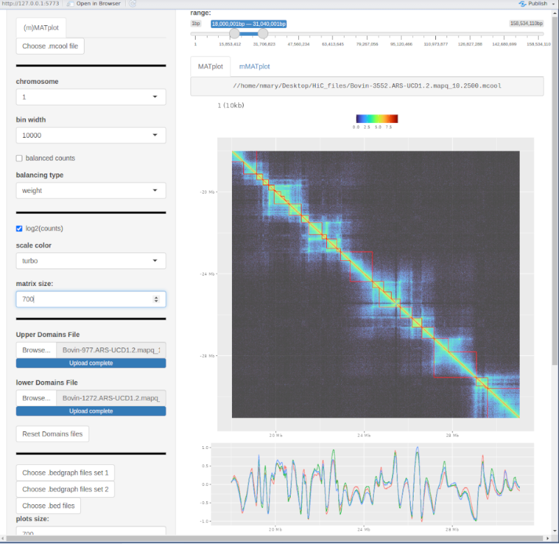

<!-- README.md is generated from README.Rmd. Please edit that file -->

# TADkitShinyApp

The goal of TADkitShinyApp is to visualize visualzie HiC matrix from
mcool file in an interactive apps. In other words, you can visualize HiC
matrices without having to write a single bit of code.

However, as mcool files are very large, the web application cannot be
deployed online and must be installed locally.

## Installation

You can install TADkitShinyApp from [GitHub](https://github.com/) with:

``` r
# install.packages("devtools")
devtools::install_github("Nico-FR/TADkitShinyApp")
```

## Use

To run the apps, you just need to run this function in R console:

``` r
TADkitShinyApp::TADkitShinyApp()
```

First, you need to select the mcool file and the application will plot
the first chromosome at the hight resolution. It also get metadatas from
the mcool, which are:

- available chromosome matrices,
- chromosome sizes,
- available resolutions (bin width),
- available balancing vectors according to their names.

## Example



### Left panel

In the order (top left panel), you can intuitively change :

- chromosome,
- resolution,
- plot balancing counts (if available),
- select balancing vectors,
- plot count values or log2(counts),
- increase/decrease plot size,
- load and plot upper domains as red triangles (tabulated, no header)
  with 3 columns (chromosome, domain start, domain end),
- load and plot lower domains as red triangles (lower part of the
  matrix),
- removed domains from the plot,
- load and plot bedgraph track (one or more files, tabulated, no header)
  with 4 columns (chromosome, start, end, score),
- load and plot a second bedgraph track,
- load and plot bed track (one or more files, tabulated, no header) with
  3 or more columns (chromosome, start, end),
- …

### Main panel

The main panel allow to move along the chromosome. By selecting the
“mMATplot” tab, you can also plot a second matrix. The mcool file can be
loaded on top of the left panel and the matrix will be plotted on the
upper part of the graph. The mcool file must have the same parameters as
those loaded on the left panel.

For more possibilities, use TADkit package
[GitHub](https://github.com/Nico-FR/TADkit).
